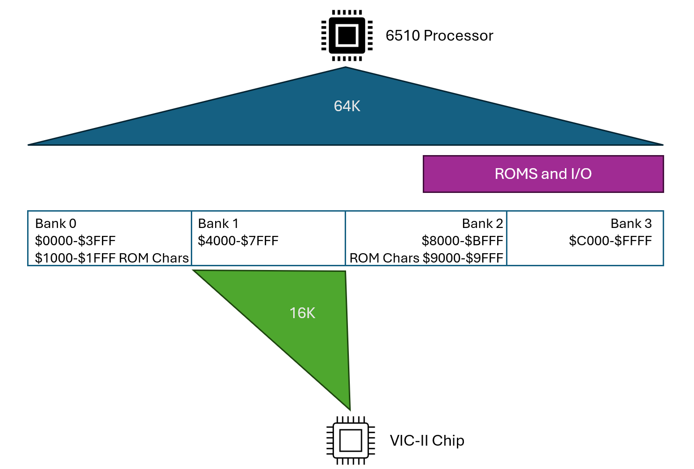

# KOALA Picture Viewer for the C64
[YouTube Video explaining everything here](https://www.youtube.com/watch?v=xtGmk7Gd_1M)

The KoalaPad was a popular graphics tablet used by digital artists in the early 1980s.  
This article is going to focus on the Commodore 64.  
The KoalaPad came with the KoalaPainter software package.  
  
This article is going to describe everything you need to know to load and display an
image created in KoalaPainter on the Commodore 64 using Assembly Language with
tools available in 1986.

## Hardware Requirements
* Commodore 64 (PAL or NTSC)
* 1 1541 Disk Drive
* KoalaPad **not** required

## Software Requirements
* [Laser Genius Assembler by Ocean](https://commodore.software/downloads/download/50-assemblers/13911-laser-genius-assembler).
    * You can use any assembler you are familiar with, but this Article will go into detail using Laser Genius.
* [Koala Images Disk 1](https://commodore.software/downloads/download/573-graphics-and-pictures/16340-koala-pictures-1)
* KoalaPainter is **not** required.  But if you are curious, look for it on the internet, download it and check it out.

I wrote this article using the VICE Emulator with the Kaola Pad Emulation turned on.
It turns out that the only version of Koala Painter II I could find on the internet had the
KoalaPad routines replaced with Joystick routines.

# Koala Painter Tour
## Loading an image
Click on the Storage icon to load an existing image.  


Replace the disk in drive 8 with the [Koala Images Disk 1](https://commodore.software/downloads/download/573-graphics-and-pictures/16340-koala-pictures-1)
and then click on the **Change Disk** button.  


Each disk can store up to 16 pictures letters a through p (kind of).  
View a picture by first clicking on the **Get** button, and then click on a **filename**.

## How the pictures are stored on disk


The pictures files are program files (PRG) and named starting with the Commodore + 1 character
followed by a name padded with spaces to 14 characters.
Let's rename the files on this disk to a simple name using this basic command:
~~~
 OPEN 15,8,15,”R:FERRARI=(press commodore+1)PIC N FERRARI “:CLOSE 15
~~~


# C64 Multicolor Hires Video Mode
This image describes the characteristics of a full screen image in the C64 Multicolor Hires Graphics mode.


## What we need to know about the VIC-II Chip

* The VIC-II Chip can only see 16K while the 6510 can see all 64K
* We can choose which 16K of the 64K it can see (Bank 0 is selected on power up, we will be using Bank 1 for this article)
* 2 of the 16K banks have a 4K ROM with the character set using 25% of the 16K
* We do not need the character ROM  when displaying our full screen picture
* Color RAM is always at $D800 and does not consume any memory in Banks 0, 1 and 2.
* We can choose to put our 8,000 bytes of Image data at the low or high 8K of the bank
* We can choose any of the remaining 8 1K slots to place our Matrix Colors Memory

## The Koala picture file format


It is quite convenient that the contents of the file match exactly what we need to produce a full screen multicolor image on the Commodore 64.
We are going to configure the VIC-II chip to use Bank 1 because by default the file format loads into $6000.

# Laser Genius Assembler
* Commodore 64
* Single 1541 disk drive
* 1660 or 1670 auto modem.
* Epyx Fastload cartridge
* Printer (Most people I knew had a Commodore MPS-801.)

The above configuration was by far the most common setup that my friends had in the 1980s.  
We grew up in Long Island, New York    
I did not know anyone that owned an REU, Hard Disk, Super CPU, JiffyDOS or even a second drive.  
I believe I had the most exotic setup of my peers as I ran a Bulletin Board for a number of years on my C64, and that was with 2 1541s and a 1581 drive.

Laser Genius was an assembler that ran really well on that simple configuration.  
You could even use it with just a tape drive.

To start Laser Genius, issue this command:
```
   LOAD "GENASM",8,1
```
You will be presented with this question:  


This will be the memory map we are going for:  


There are four regions of memory we need to place:
* **Full Image Data** - This is the image data that will be loaded into memory
    * Notice that it is wider than the VIC-II bank 1.  More on this later.
* **Object Code** - This is where our compiled code will reside.
* **Assembler** - This is the Laser Genius program software.
* **Source Code** - This is the actual source code of our program.

Before starting any project on a C64, you really need to think about where you are going to place things into memory.  
With this map we have created, we can choose the **HIGH MEMORY VERSION** option.

You will now be presented with a question about Text Memory (This really means Source Code memory):


Type in **$0800,$2FFF** and press enter.  
This will configure Laser Genius to store the source code in between those memory addresses.

You can now change the disk in drive 8 with the pictures disk.

Disk commands can be issued in a manor very similar to the C64 DOS Wedge or Jiffy DOS.  
Type in **@$** to get a directory of the drive.


## Entering Code
Code is entered using line numbers because Laser Genius uses the BASIC line editor.  
To get started, type **AUTO 10** to turn on auto line numbering.  
**MANUAL** will turn it off.

Let's start out by writing a high level blueprint of what we want our program to do:  
When you type in the code, it will initially look like this:


Press enter after 120 to get to an empty line.
Then type **list** to list the program:

The code will now automatically be formated:  


You can also type **print** to list the code without the line numbers.

## Blueprint
This is the entire blueprint code we are going to start with:

~~~
                ;@:PIC.S
                .ORG    $3000
                ;----------------
                ;SHOW KOALA PIC
                ;----------------
                JSR LOADFILE
                JSR CONFIGVIC
                JSR COPYCOLORS
                JSR WAITKEY
                JSR RESTOREVIC
                RTS 
                ;----------------
                ;TODO
                ;----------------
LOADFILE        RTS 
CONFIGVIC       RTS 
COPYCOLORS      RTS 
WAITKEY         RTS 
RESTOREVIC      RTS 
~~~

**;@:PIC.S**  
This first line defines the filename of our source code.  
Simply type **SAVE ^** to save our source code file to disk.    
When ever Laser Genius sees an ^, it replaces it with the filename in the first comment.  
The **@:** in front of the filename lets the drive know to delete and replace it with the new file.  
Without it, you would have to manually delete the file before you save it.

**.ORG $3000**
This tells the assembler that the assembled code will be stored at memory address $3000.

**TODO Section**  
The JSRs are the steps that we want our program to take.    
We will implement these routines and test each one.  
But not in the order you think.

There are two ways to assemble and run a program:  
**ASM,M**  This will assemble the code and place it at the .org address ($3000)  
If all goes well, it should say **SUCCESSFULL ASSEMBLER; NO ERRORS.**  
We can now type **SYS $3000** to run our program.
If all goes well, nothing will happen and you will see a **READY.** prompt.

The second way is to type **RUN** and press return.  
At first glance, this will appear to be the same as ASM,M, but it's very different.  
RUN will find an unallocated spot in the Source Code memory and assemble your code there, and then SYS whatever address it found.  
We can safely use **RUN** instead of **ASM,M** and **SYS $3000** going forward.

## WAITKEY
Let's implement the WAITKEY routine with this code:
```
                ;----------------
                ;WAITKEY
                ;----------------
K.CHRIN        =$FFE4
WAITKEY         JSR $FFE4
                BEQ WAITKEY
                RTS 
```

Search for the WAITKEY in the TODO section and remove it.  
**FIND "WAITKEY"**  
Delete the line that says **WAITKEY RTS** with the command **DELETE LineNumber**
The K.CHRIN is a label for a KERNAL call called CHRIN.  
It will check the keyboard buffer, and if nothing has been pressed, it will load a 0 into the Accumulator which results in setting the ZERO Flag in the Process Status.    
BEQ (Branch on Zero Flag Set) will loop to WAITKEY and keep checking until a key is pressed.    
**RUN** the program, and it should wait for you to press any key and then return to the READY. prompt.  
**SAVE ^** and let's move on.

## CONFIGVIC


```
                ;----------------
                ; CONFIGVIC
                ;----------------
CONFIGVIC       LDA #$02
                STA $DD00
                LDA #$3B
                STA $D011
                LDA #$D8
                STA $D016
                LDA #$78
                STA $D018
                RTS
```
Remove the TODO line that defines CONFIGVIC
Before running this, let's save it with...
```
save ^
```
This will cause the assembler to save the file with the filename that is in
the comment in the first line of our source code (@:pic.s)

When we run the program, we will get a blank screen.  It appears our program crashed.
The VIC Chip has changed its configuration.
We can press runstop + restore to reset the VIC chip and get back to our code.  
Choose no when asked the New question.
How do we know that our code worked correctly?
Well, we can load an image into memory and then run our program again.
We know the pixel data will load, so we should see something when we run our program.
To load a file into memory we can use the mload command like this:
```
@$
mload "tiger"
```
Now we see a black and white picture of our tiger.
With this knowledge in place, let's write the routine that switches the VIC back to normal
## RESTOREVIC
```
                ;----------------
                ; RESTOREVIC
                ;----------------
RESTOREVIC      LDA #$03
                STA $DD00
                LDA #$1B
                STA $D011
                LDA #$C8
                STA $D016
                LDA #$15
                STA $D018
                LDA #$0B
                STA $D021
                RTS
```
Remove the JSR RESTOREVIC from the TODO Section.
list !todo
delete the line number
Save it:
```
save ^
```
run it.  
You should see a black and white tiger now.  
Press a key.  
We should return to our assembler.
We are now down to just two more functions.

## COPY COLORS

This routine will..
* Copy the 1,000 byte matrix from $6000+8000 to $5C00
* Copy the 1,000 byte color ram from $6000+9000 to $D800
* Copy the 1 byte of Screen Color to $D021

``` 
                ;----------------
                ;COPYCOLORS
                ;----------------
VICBANK        =1
VICBASE        =$4000*VICBANK
BITMAP         =VICBASE+$2000
MATRIX         =VICBASE+$1C00
CLRMEM         =$D800
COPYCOLORS      LDX #0
LOOP            
                LDA BITMAP+8000,X
                STA MATRIX,X
                LDA BITMAP+8250,X
                STA MATRIX+250,X
                LDA BITMAP+8500,X
                STA MATRIX+500,X
                LDA BITMAP+8750,X
                STA MATRIX+750,X
                LDA BITMAP+9000,X
                STA CLRMEM,X
                LDA BITMAP+9250,X
                STA CLRMEM+250,X
                LDA BITMAP+9500,X
                STA CLRMEM+500,X
                LDA BITMAP+9750,X
                STA CLRMEM+750,X
                INX 
                CPX #250
                BNE LOOP
                LDA BITMAP+10000
                STA $D021
                RTS 
```

## Load File
This routine will load a file from disk into memory

```
                ;----------------
                ;LOAD IMAGE FILE
                ;----------------
FNAME           .BYTE   5,'TIGER'
DEVICE         =$BA
SETLFS         =$FFBA
SETNAM         =$FFBD
SETMSG         =$FF90
LOAD           =$FFD5
LOADFILE        LDA #$00
                JSR SETMSG
                LDA #1
                LDX DEVICE
                LDY #1
                JSR SETLFS
                LDA FNAME
                LDX #FNAME+1&255
                LDY #FNAME+1/256
                JSR SETNAM
                LDA #0
                LDA #0
                JSR LOAD
                LDA #%11000000
                JSR SETMSG
                RTS  
```


## Slide Show
Let's make a slidel show.
We will build a list of filenames in our code, and then show each one by one.   
Let's start by making a copy of pic.s into slideshow.s

Now let's make some changes...
Let's add a label to turn this whole program into a routine we can JSR to by adding a label KOALA.
The first line of code will now jump to a slideshow label where we will implement our slideshow logic.
```
                ;@:SLIDESHOW.S
                .ORG    $3000
                JMP SLIDESHOW
                ;----------------
                ;SHOW KOALA PIC
                ;----------------
KOALA           JSR LOADFILE
                JSR CONFIGVIC
                JSR COPYCOLORS
                JSR WAITKEY
                JSR RESTOREVIC
                RTS 

```

Let's start with just 4 filenames for now, each seperated by a null (0) character.
The last filename will be a 0 character.  This will be how we detect we have reached the last filename.
```
                ;----------------
                ;SLIDESHOW
                ;----------------
FNAMES          .BYTE   'FERRARI',0
                .BYTE   'MICRO',0
                .BYTE   'SUNDAE',0
                .BYTE   'SHOP',0
                .BYTE   0
```

So the main program is now slideshow.
We are going to iterate one character at a time starting at the label FNAMES, using the X index.    
The Y index register will iterate from 0 to the end each filename (marked by a null) storing each character
at the FNAME label.  When it reaches a null, we will store the Y index register at FSIZE, and then reset Y to 0 to
process the next filename.


```                
SLIDESHOW       
                LDX #0
                LDY #0
NAMELOOP        LDA FNAMES,X
                BEQ NAMEDONE
                STA FNAME,Y
                INY 
                INX 
                JMP NAMELOOP
NAMEDONE        
                CPY #0
                BEQ ALLDONE
                STY FSIZE
                TXA 
                PHA 
                TYA 
                PHA 
                JSR KOALA
                PLA 
                TAY 
                PLA 
                TAX 
                INX 
                LDY #0
                JMP NAMELOOP
ALLDONE         RTS 
```

So this works, but it goes into and out of the VIC Bank 1 configuration between each file.  
Let's move the CONFIGVIC and RESTOREVIC calls to the start and of slowshow.  


   


